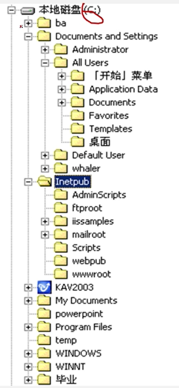

[TOC]

## 前言
1. 什么是数据结构？

> 程序 = 数据结构 + 算法

2. 课程内容

 
3. 如何学好？
- 勤于思考
- 多做练习
- 多上机（使用编程语言实现）
- 善于寻求帮助
- 不怕困难，不放弃！！！

## 1. 绪论
### 1.1 数据结构的研究内容

- **例1 学生管理系统**
对象：每位学生的信息（学号、姓名、性别、籍贯、专业...）
算法：查询、插入、修改、删除
关系：线性关系
数据结构：线性数据结构、线性表

类似的还有图书管理系统、人事管理系统、仓库管理系统、通讯录...
对象：若干行数据记录
算法：查询、插入、修改、删除
关系：线性关系
数据结构：线性数据结构、线性表
![[attachment/C1/T1-1-1学生管理系统-线性表.excalidraw]]

- **例2 人机对弈问题**
当前格局->派生格局->派生格局

![[attachment/C1/T1-1-2人机对弈问题-树.excalidraw]]

对象：各种棋局状态
算法：走棋，即选择一种策略使棋局状态发生变化（格局->另一个格局）
关系：非线性关系，树形结构
数据结构：树

- **文件系统的系统结构图**
子文件夹下可以包含多个子文件夹，但是每个子文件夹只能属于一个父文件夹 - 树型结构

- **例3 地理信息处理：  地图导航 - 求最短路径（最快路径）**

网状结构

![[attachment/C1/T1-1-3地铁导航求最短路径]]
对象：各地点和路的信息
算法：设置信号灯，求各个可同时通行的路的集合。
关系：非线性关系、网状结构
数据结构：图

- **小结**
	- 这些问题的共性是都无法用数学的公式或者方程来描述，是一些“非数值计算”的程序设计问题。
	- 描述非数值计算问题的数学模型不是数学方程，而是诸如表、树和图之类的具有逻辑关系的数据。
	- 数据结构是一门研究非数值计算的程序设计中计算机的操作对象以及他们之间的关系和操作的科学

### 1.2 基本概念和术语1
#### 1.2.1 数据、数据元素、数据项和数据对象
- 数据（Data）
	- 是能输入计算机且能被计算机处理的各种符号的集合
		- 信息载体
		- 是对客观事物符号化的表示
		- 能够被计算机识别、存储加工
	- 包括：
		- 数值型数据：整数、实数（可进行算数运算的）
		- 非数值型的数据：文字、图像、图形、声音等
- 数据元素（Data Element） 
	- 是数据的基本单位，在计算机程序中通常作为一个整体进行考虑和处理。也称为元素、记录、结点或顶点（如学生表中某一个学生的一行个人记录）
	- 一个数据元素可由若干个数据项组成
- 数据项（Data Item）
	- 构成数据元素的不可分割的最小单位 （如一张学生表中的出生日期）
	- **数据、数据元素、数据项之间的关系**：
		- 数据 > 数据元素 > 数据项        例：学生表 > 个人记录 > 学号、姓名......
- 数据对象（Data Object）
	- 是性质相同的数据元素的集合，是数据的一个子集。
		例如：
		-  整数 数据对象是集合N={0, ±1, ±2, ... }
		-  字母字符 数据对象是集合C={'A', 'B', ... , 'Z'}
		-  学籍表 也可看做一个数据对象
 **数据元素与数据对象**
 - 数据元素 - 组成数据的基本单位
	 - 与数据的关系：是集合的个体
 - 数据对象 - 性质相同的数据元素的集合
	 - 与数据的关系：集合的子集

#### 1.2.2 数据结构 （Data Structure）
- 数据结构 
	- 数据元素不是孤立存在的，它们之间存在着某种关系，数据元素相互之间的关系称为结构 (Structure)
	- 是指相互之间存在一种或多种特定关系的数据元素集合
	- 数据结构是带结构的数据元素的集合
- 数据结构包括：
	1. 数据元素之间的逻辑关系，也称为逻辑结构。
	2. 数据元素及其关系在计算机内存中的表示（映像），称为数据的物理结构或数据的存储结构
	3. 数据的运算和实现，即对数据元素可以施加的操作以及这些操作在相应的存储结构上的实现

**数据结构的两个层次**
- 逻辑结构
	- 描述数据元素之间的逻辑关系
	- 与数据的存储无关，独立于计算机
	- 是从具体问题出现出来的数学模型
-  物理结构（存储结构）
	- 数据元素及其关系在计算机存储器中的结构（存储方式）
	- 是数据结构在计算机中的表示
- 逻辑结构与存储结构的关系
	- 存储结构是逻辑关系的映像与元素本身的映像。
	- 逻辑结构是数据结构的抽象，存储结构是数据结构的实现
	- 两者综合起来建立了数据元素之间的结构关系。
**逻辑结构的种类**
划分方法一
(1) 线性结构 （1:1 关系）
有且仅有一个开始和一个终端结点，并且所有结点都最多只有一个直接前趋和一个直接后继。
例如：线性表、栈、队列、串
(2) 非线性结构 （1:n 或 m:n 关系）
一个结点可能有多个前趋和多个直接后继
例如：树、图
划分方法二 - 四类基本逻辑结构
![[attachment/C1/T1-1-2-2-四类基本逻辑结构.excalidraw]]
（1）集合结构：结构中的数据元素之间除了同属于一个集合的关系外，无任何其他关系。
（2）线性结构：结构中的数据元素之间存在者一对一的线性关系。
（3）树结构：结构中的数据元素之间存在着一对多的层次关系。
（4）图状结构或网状结构：结构中的数据元素之间存在着多对多的任意关系。
**存储结构的种类**
四种基本的存储结构
- 顺序存储结构
	- 用一组连续的存储单元依次存储数据元素，数据元素之间的逻辑关系由元素的存储位置来表示
	- C语言中用数组来实现顺序存储结构。例：（bat,cat,eat,  ....）
![[attachment/T1-1-3excalidraw]]
- 链式存储结构
	- 用一组任意的存储单元存储数据元素，数据元素之间的逻辑关系用指针来表示。
	- C 语言中用指针(地址)来实现链式存储结构。例：（bat,cat,eat,  ...., mat）
- 索引存储结构
- 散列存储结构